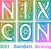

# NixCon 2023 Website

This repository contains the website for NixCon 2023 in Darmstadt.

## Build

Builds are run using nix-flakes, so you just need to run:

```
nix build
```

The resulting derivation will contain the servable website contents in it's root.

## Development

The flake provides a shell which you can invoke with `nix shell`, otherwise you will have to have `nodejs` installed. Then you can run:

```
npm install
npm run dev
```
